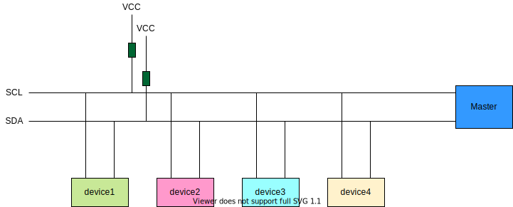
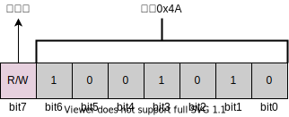

I2C的总线协议较为简单，由两根线组成，分别为串行数据线SDA和串行时钟线SCL，物理连接很简单，就是将设备的SDA和SCL分别连接在对应的总线上，总线需要通过电阻上拉到电源，通常为3.3V，这类电阻叫做上拉电阻，原理就是通过SCL和SDA的高低电平进行时序的控制以此来通信，因为I2C是串行总线，多个设备可以同时连接到总线上，拓扑结构如下：

I2C通信的速度有多种模式，标准模式下可达100kbit/s，快速模式下可达400kbit/s，高速模式下可达3.4Mbit/s，常用的通信速度是快速模式，不同的模式对应的上拉电阻不同，通常100K需要上拉电阻为10KΩ，400K则要2.2KΩ左右（曾经咨询过团队专家，普通设备是不支持高速模式的）。

I2C通过上拉电阻将SCL和SDA的电平拉高后，总线上的设备在空闲状态都是处于高电平。当设备需要与外界进行通信时，设备上的SCL和SDA电平则会输出低电平，总线电平也会被拉低，所以总线与设备之间是‘线与’关系，这里面涉及到好几个知识点：

- 主从设备：I2C总线上连接的设备都可以作为主设备或从设备，每个设备在总线上都对应唯一的地址（7bits），通常设备在与CPU通信中将CPU作为master，设备本身作为slave，CPU就是通过唯一地址来确定并建立链接（设备的唯一地址在对应datasheet可以查询到）。

- 中断方式：当从设备进程执行结束或检测到外界信息有变化，需要通知主设备来做相应处理时，从设备是通过触发中断的方式通知主控的，中断触发包括低电平触发、边沿触发（上升沿触发、下降沿触发、双边沿触发）。当总线被上拉电阻拉高后处在高位为1（电压在2.8V ~ 3.3V）， 处在低位为0（电压在0V ~ 1.2V），低电平触发表示当电平为低时触发中断，中断控制器会产生一个脉冲通知CPU来做处理，低电平触发劣势在于有时中断触发没有生成，事件被遗漏没有处理，也有可能一直让设备处于低电平。边沿触发就是在电平上升或下降过程中进行中断触发，优势在于当总线电平出现变化的时候就会发生触发通知CPU有事件需要处理，劣势在于当设备受外界干扰电平不稳定，极短的时间内会造成电平上下波动，这种情况下容易造成误触发，导致CPU频繁处理挂死当前进程。

- 通信方式：因为总线上只有一根SDA数据线，同一时间只能单向通信，所以I2C总线通信方式是半双工。

I2C协议规定了总线上数据的传输必须以一个起始信号作为开始条件，以一个结束信号作为传输的停止条件，也就是说在数据传输过程中必须有起始信号和结束信号。起始和结束信号总是由主设备产生的（这就说明了从设备不可以主动通信，通信只能由主设备发起并结束，主设备可以发出询问的命令，然后等待从设备ACK以此建立通信连接)。

起始和结束信号产生条件：总线在空闲状态时，SCL和SDA都保持着高电平，当SCL为高电平而SDA由高到低的跳变，表示产生一个起始条件；当SCL为高而SDA由低到高的跳变，表示产生一个停止条件。

在起始条件产生后，总线处于忙碌状态，由本次数据传输的主从设备独占，其他I2C器件无法访问总线；而在停止条件产生后，本次数据传输的主从设备将释放总线，总线再次处于空闲状态。

起始和结束如图所示：

I2C协议规定，在主设备传输完1byte的数据，后面必须紧跟一个校验位ACK，这个校验位是从设备通过控制SDA（数据线）来实现的，以提醒主设备完成数据的全部接收，可以继续进行数据传送。1byte数据是8bits，再加上1bit的ACK，总计9bits，可以将此9bits叫做帧，一帧数据发送简化如下：

数据在实际传输中，先传输的是高位数据，然后才是低位数据，最后才是检验位。当主设备将8bits数据传给从设备后，从设备控制自身的SDA线拉低，总线上的SDA线也随之变低，回传给主设备一个应答位；当从设备无法再继续接收数据时，也会反馈一个消息（应答非）给主设备。（也可以理解为当主设备发送完1byte数据后检查SDA线的电平等待从设备反馈，SDA电平拉低表示接收正常，SDA电平为高位表示无法继续接收，当主设备知道从设备无法继续接受数据的时候便控制总线产生结束信号）。

另外上面介绍过，在I2C总线上的设备都有一个唯一7bits地址，另外1bit就是表示R或W，R表示主设备向从设备读取操作，W表示主设备向从设备写入操作，此8bits是如何排列的呢？

以我熟悉的产品为例，地址为0x4A，从bit7~bit0排列如下：

一个完整的数据读写流程如下：

有个额外需要了解的是，当主设备在向从设备写入数据完后，需要读取从设备的数据，不需要先停止再重新启动，只需要控制SDA和SCL产生新的起始条件就行，当然地址验证和读写位还是需要继续确认的，如下：

